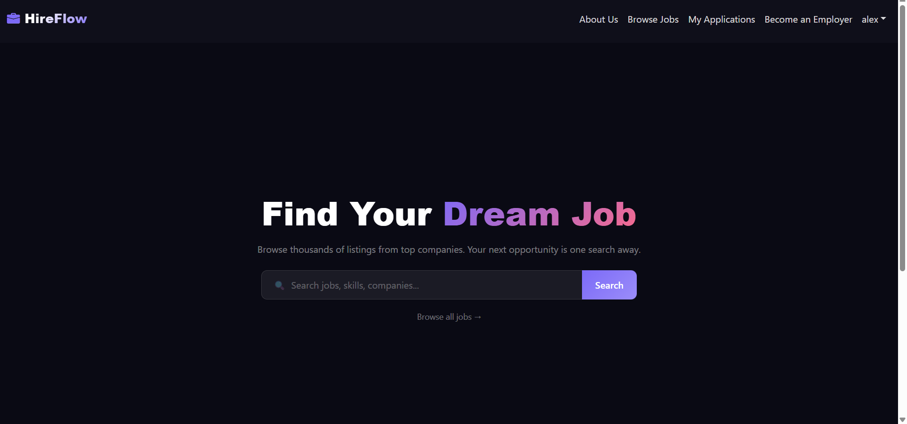
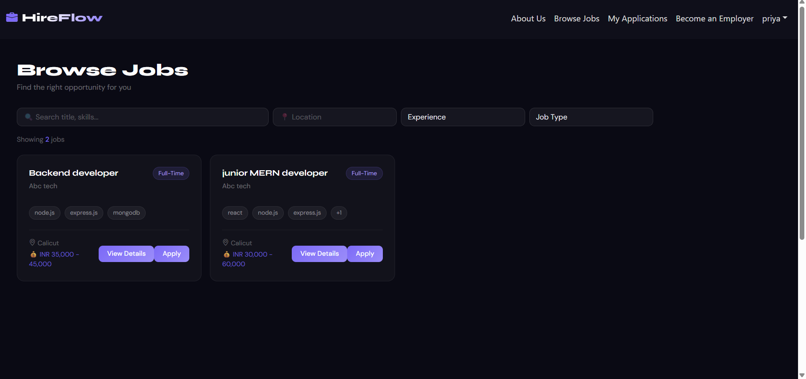
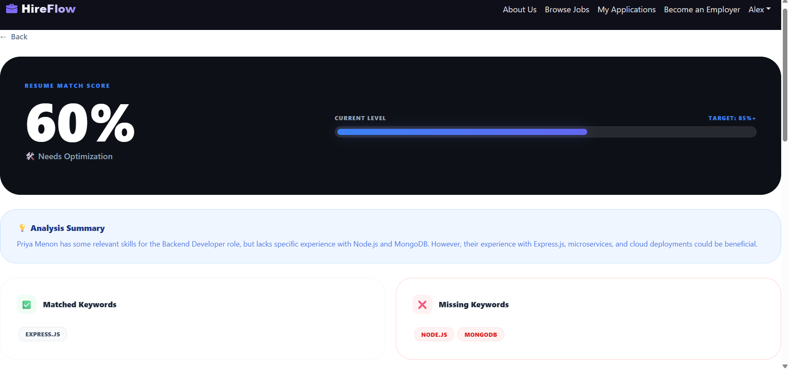
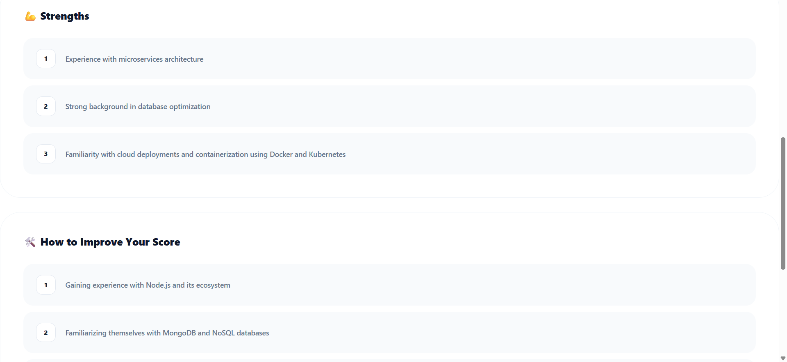
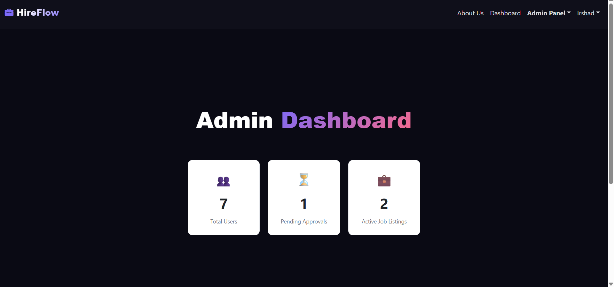
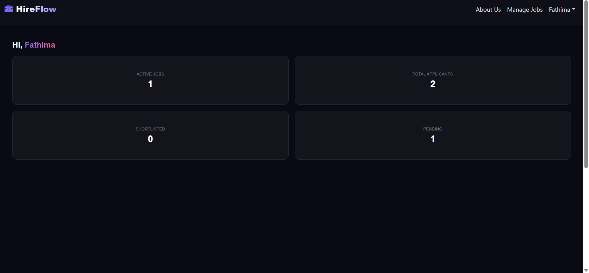
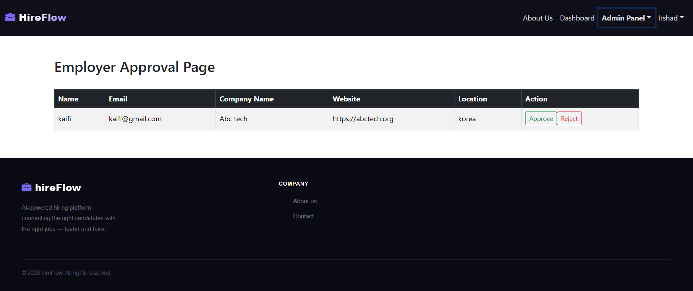
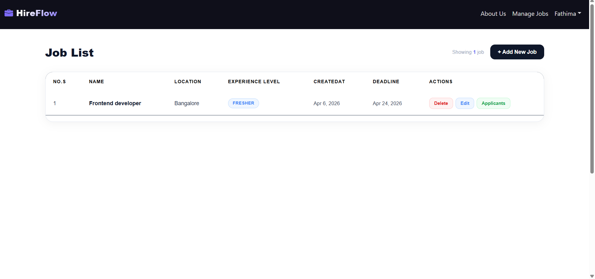
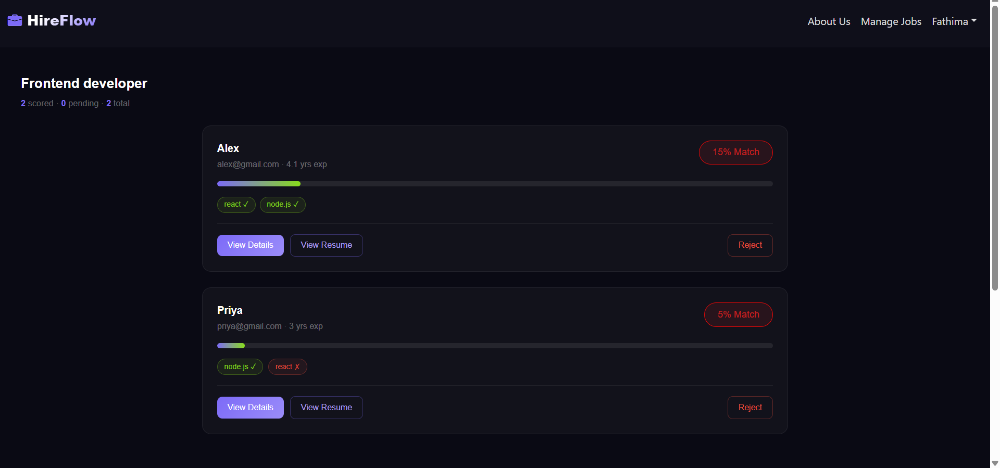
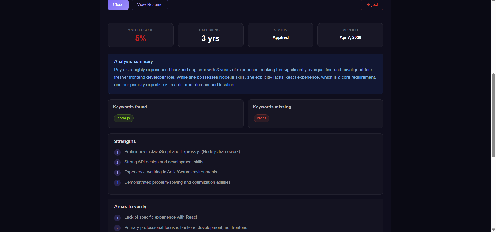

# 🤖 AI-Powered Resume Intelligence System

A full-stack **MERN** application that automates and humanizes the hiring process using Artificial Intelligence. The platform connects job seekers and employers through AI-driven resume parsing, smart candidate ranking, and actionable feedback.

---

## 📖 About the Project

Traditional hiring is slow and biased. This platform uses AI to automatically parse resumes, match candidates to job descriptions, rank applicants, and provide transparent feedback — making recruitment faster, fairer, and more insightful for both employers and job seekers.

---

## ✨ Features

- 🔐 **JWT Role-Based Authentication** — Secure login for Admin, Employer, and Job Seeker roles
- 📄 **AI Resume Parser** — Extracts contact info, skills, and work history from PDF/DOCX files
- 🎯 **AI Screening & Matching** — Compares resumes against job descriptions to generate match percentages
- 💬 **AI Feedback Module** — Gives candidates constructive insights on resume strengths and improvements
- 📋 **Job Management** — Employers can create, edit, and close job postings
- 📊 **Ranked Applicant Pools** — Employers see AI-ranked candidate lists instantly
- 🧑‍💼 **Job Seeker Dashboard** — Upload resumes and view personalized career growth suggestions
- 🛠️ **Admin Dashboard** — Manage users, promote roles, and monitor platform analytics

---

## 🛠 Tech Stack

| Layer | Technology |
|---|---|
| Frontend | React.js |
| Backend | Node.js, Express.js |
| Database | MongoDB |
| Authentication | JWT (JSON Web Tokens) |
| AI | Gemini API |
| File Parsing | pdf-parse, mamoth |
|  API Testing | Postman |
---

## 🧩 Modules

### 1. 🔐 User Authentication
- Secure registration and login
- Three roles: **Admin**, **Employer**, **Job Seeker**
- JWT-based session management

### 2. 📄 AI Resume Parser
- Upload PDF or DOCX resumes
- Automatically extracts contact info, skills, education, and work history

### 3. 🎯 AI Screening & Feedback
- Compares resume content against job descriptions
- Generates a **match percentage score**
- Provides detailed, candidate-specific feedback

### 4. 📋 Job Management
- Employers can post, edit, and close job listings
- View AI-ranked applicant list per job posting

### 5. 🧑‍💼 Job Seeker Dashboard
- Upload and manage resumes
- View AI-generated career improvement suggestions

### 6. 🛠️ Admin Dashboard
- Manage all platform users
- Promote users to Employer role
- Monitor platform analytics and activity

---
## Screenshots

### Home Page

### Job Listing

### AI Screening Result

### Dashboard

### Notification

### Job Management

### Ranked List

> Built with ❤️ to humanize the automated hiring process.